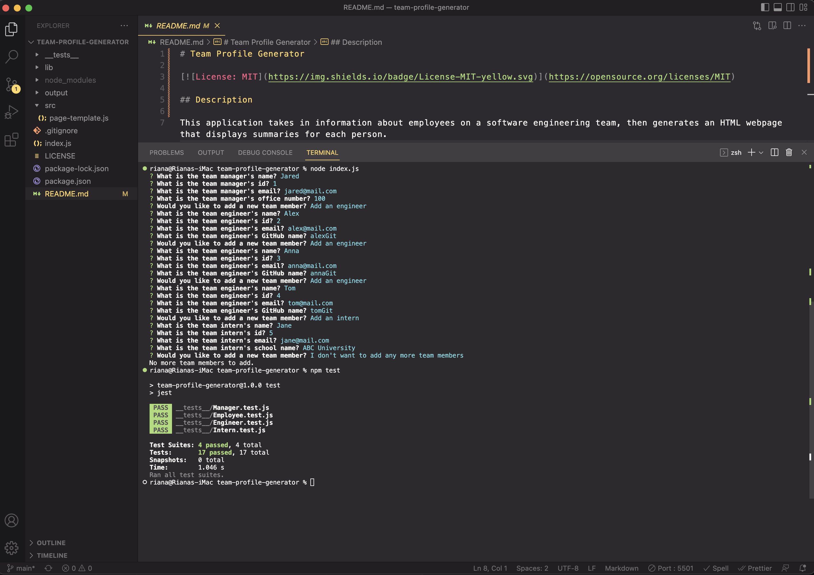
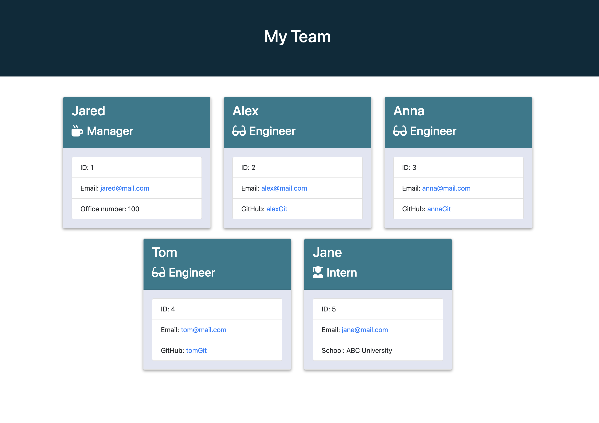

# Team Profile Generator

[](https://opensource.org/licenses/MIT)

## Description

This application takes in information about employees on a software engineering team, then generates an HTML webpage that displays summaries for each person.

[Link to the Generated HTML file](https://celiyo.github.io/team-profile-generator/output/team.html)

Application demo



Generated **team.html** file



## Table of Contents

- [Installation](#installation)
- [Usage](#usage)
- [Tests](#tests)
- [Contributing](#contributing)
- [License](#license)

## Installation

To install the necessary dependencies, run the following command:
```
npm i
```

## Usage

To start the app, run the following command:
```
node index.js
```

## Tests

The following command can be run for testing:
```
npm run test
```

## Contributing

Contributions, issues and feature requests are welcome.  Browse the source repository of this article and open a pull request. I will do my best to review your proposal in due time.

## License

This project is licensed under the [MIT License](LICENSE).
